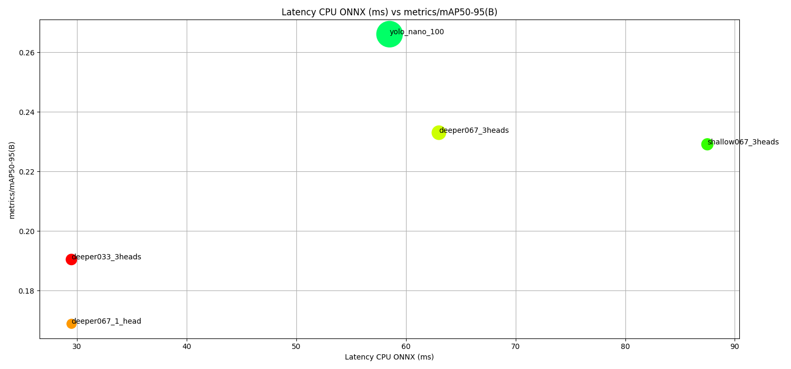
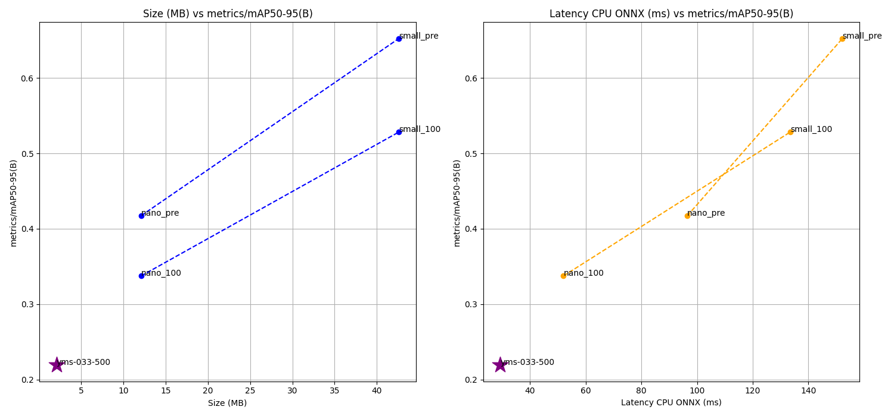

## Object detection

This object detection recipe is heavily based and depends on YOLO v8, developed by [Ultralytics](https://github.com/ultralytics/ultralytics)
It supports training and inference, for now, tested on the COCO dataset.

To reproduce our results, you can follow these steps:

1. install PhiNets with `pip install git+https://github.com/fpaissan/micromind` or `pip install -e .` (in the root folder)
2. install the additional dependencies for this recipe with `pip install -r extra_requirements.txt`
3. launch the training script on the dataset you want

### COCO

```
python detection.py
```

For now, everything has to be changed inside the detection.py code. We are working on a more user-friendly interface.

### Dataset

Note the dataset has to be downloaded, so it is recommended to run it in a docker environment.

### Benchmark

Comparison between accuracy, number of parameters and mAP. ONNX test on CPU.
The size of the dot indicates the size of the model in MB.

In the table is a list of PhiNet's performance on some common image classification benchmarks.
The architecture was made of the backbone with PhiNet. Also, the detection head was modified to substitute the C2f layers with PhiNetConvBlock layers.



| Dataset | Model arguments                                                                               | mAP50  | latency (ms) | size (MB) | layers  | parameters | GFLOPS  |
| ------- | --------------------------------------------------------------------------------------------- | ------ | ------------ | --------- | ------- | ---------- | ------- |
| COCO-80 | `PhiNet(alpha=0.67, beta=1, t_zero=4, num_layers=6)`                                          | 0.2561 | 114.75       | 2.7       | 178     | 573787     | 10.3    |
| COCO-80 | `PhiNet(alpha=0.33, beta=1, t_zero=4, num_layers=7, num_heads=3)`                             | 0.1904 | 30.51        | 2.1       | 189     | 528467     | 2.6     |
| COCO-80 | `PhiNet(alpha=0.67, beta=1, t_zero=4, num_layers=7 num_heads=3)`                              | 0.2330 | 43.25        | 3.5       | 189     | 891099     | 4.2     |
| COCO-80 | `PhiNet(alpha=1, beta=1, t_zero=4, num_layers=7, num_heads=3)`                                | 0.1904 | 30.51        | 3.5       | waiting | waiting    | waiting |
| COCO-80 | `PhiNet(alpha=0.67, beta=1, t_zero=4, num_layers=7, num_heads=1)`                             | 0.1688 | 32.49        | 1.6       | 152     | 403803     | 2.0     |
| COCO-80 | `PhiNet(alpha=0.67, beta=1, t_zero=4, num_layers=7, num_heads=3) + C2f in the detection head` | 0.1688 | 32.49        | 1.6       | waiting | waiting    | waiting |

### Yolo Original

Here instead the detection head was kept in the original way.



| Dataset | Model arguments                                                   | mAP50  | latency (ms) | size (MB) |
| ------- | ----------------------------------------------------------------- | ------ | ------------ | --------- |
| COCO-80 | `PhiNet(alpha=0.67, beta=1, t_zero=4, num_layers=6)`              | 0.2561 | 114.75       | 2.7       |
| COCO-80 | `PhiNet(alpha=0.33, beta=1, t_zero=4, num_layers=7, num_heads=3)` | 0.1904 | 30.51        | 2.1       |


### Cite PhiNets
```
@article{10.1145/3510832,
	author = {Paissan, Francesco and Ancilotto, Alberto and Farella, Elisabetta},
	title = {PhiNets: A Scalable Backbone for Low-Power AI at the Edge},
	year = {2022},
	publisher = {Association for Computing Machinery},
	address = {New York, NY, USA},
	url = {https://doi.org/10.1145/3510832},
	doi = {10.1145/3510832},
	journal = {ACM Trans. Embed. Comput. Syst.},
}
```
