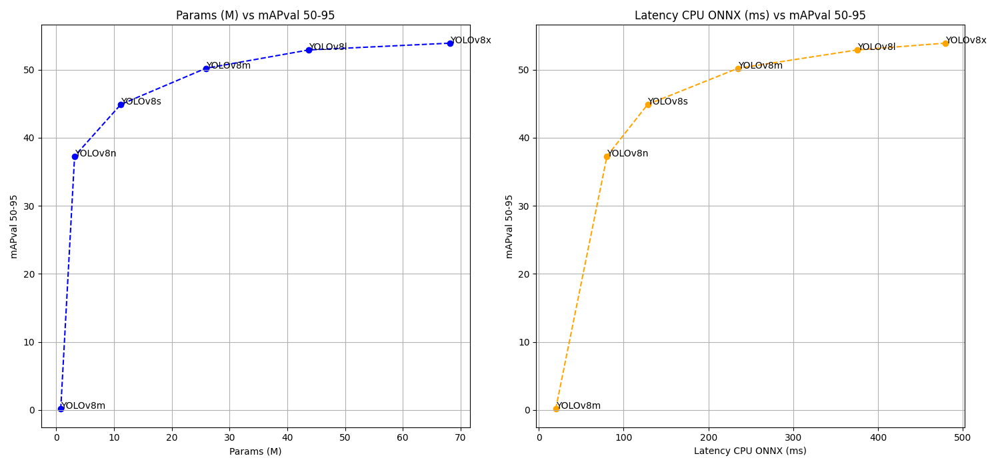

## Object detection

This object detection recipe is heavily based and depends on YOLO v8, developed by [Ultralytics](https://github.com/ultralytics/ultralytics)
It supports training and inference, for now, tested on the COCO dataset.

To reproduce our results, you can follow these steps:

1. install PhiNets with `pip install git+https://github.com/fpaissan/micromind`
2. install the additional dependencies for this recipe with `pip install -r extra_requirements.txt`
3. launch the training script on the dataset you want

### COCO
```
python train.py
```

For now, everything has to be changed inside the train.py code. We are working on a more user-friendly interface.

### Benchmark
Comparison between accuracy, number of parameters and mAP. ONNX test on CPU.


In the table is a list of PhiNet's performance on some common image classification benchmarks.

| Dataset | Model name                                           | mAP50  | latency (ms) | size (MB) |
| ------- | ---------------------------------------------------- | ------ | ------------ | --------- |
| COCO    | `PhiNet(alpha=0.67, beta=1, t_zero=4, num_layers=6)` | 0.2561 | 114.75       | 2.7       |


### Cite PhiNets
```
@article{10.1145/3510832,
	author = {Paissan, Francesco and Ancilotto, Alberto and Farella, Elisabetta},
	title = {PhiNets: A Scalable Backbone for Low-Power AI at the Edge},
	year = {2022},
	publisher = {Association for Computing Machinery},
	address = {New York, NY, USA},
	url = {https://doi.org/10.1145/3510832},
	doi = {10.1145/3510832},
	journal = {ACM Trans. Embed. Comput. Syst.},
}
```
